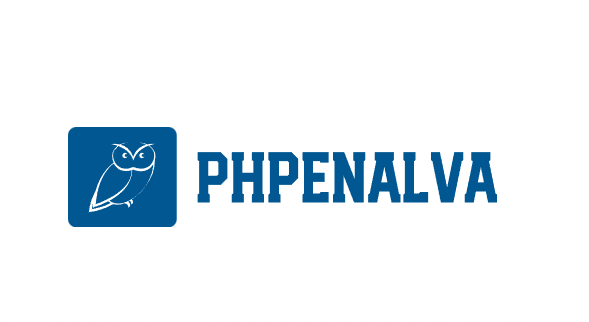

# PHPenalva 𓅓


### Overview
PHPenalva is a lightweight PHP micro-framework designed on the Model-View-Controller (MVC) architecture.<br>
Built with simplicity in mind, PHPenalva empowers you to swiftly create APIs and web applications.<br>

**Note**: This project is currently under construction. Please bear with us as we work to make it even better.

### Requirements
- **PHP Version**: PHP 7.4 or higher is required.
- **Web Server**: You'll need a web server with URL rewriting enabled.
- **Supported Servers**: PHPenalva plays nicely with Apache, Nginx, and IIS.
- **Database Compatibility**: PHPenalva is compatible with MySQL, MariaDB, PostgreSQL, and SQLite.
- **Platform**: PHPenalva can be used on Linux, Windows, and macOS.

### Installation
Getting started with PHPenalva is a breeze. <br>
You can install it via Composer with the following command in your project directory:<br>
`composer create-project hiyan/phpenalva your_project_name`

### Development Environment

PHPenalva comes with a pre-configured development environment using Docker, which simplifies the setup and execution of the microframework without the need to install servers and dependencies directly on your machine.

#### How to Use the Development Environment

1. **Starting the Environment**: You can start the development environment with the following command. This will launch the necessary Docker containers to run PHPenalva:
   ```bash
   composer start
   ```
   
   This command runs `docker compose up -d`, starting the containers with a web server and database ready for use.

2. **Environment Structure**: All Docker environment configurations are located in the `.docker` directory. In this directory, you'll find configuration files like `Dockerfile` and `nginx.conf`, which define how the environment is built and how services (PHP, NGINX, etc.) are configured.

3. **Customization**: If you need to adjust the development environment (e.g., change NGINX settings or add PHP extensions), you can edit the files within the `.docker` directory to customize the environment as needed.

4. **Stopping the Environment**: To stop the development environment, use the following command:
   ```bash
   composer stop
   ```
   This command runs `docker compose down`, shutting down the running containers.

With this setup, you can focus on developing with PHPenalva without worrying about complex local configurations. Simply run `composer start` to begin and `composer stop` to halt the environment as needed.

These commands make it easy to manage the environment, allowing you to work directly on the project with convenience! 🚀

### Routes Example
Here are some example routes that you can define in your PHPenalva application:

**Route with views:**

- **GET /posts**: List all posts. Access it in your browser to view the posts.
- **GET /post/{id}**: View details of a specific post. Replace `{id}` with the desired post ID in the URL.

**Route without views:**

- **POST /post**: Create a new post. Send a POST request to this route with the required parameters to create a new post.
- **PUT /post/{id}**: Update an existing post. Send a PUT request to this route with the required parameters to update an existing post. Replace `{id}` with the desired post ID in the URL.
- **DELETE /post/{id}**: Delete an existing post. Send a DELETE request to this route.

**Authenticated Routes:**
To use route authentication in PHPenalva, add `'auth'` to your route definition. For example:
```php
$route[] = ['GET', '/posts', 'PostController@index', 'auth'];
```
To access an authenticated route, you must log in via the `/api/login` route. If you don't have an account, create one using `/user/create`. After logging in, you'll receive an access token, which you can use to access authenticated routes. Add the token to the Authorization header of your request, e.g., `Authorization: Bearer {token}`, or use it as a query parameter, e.g., `/posts?token={token}`.

### Documentation
Our comprehensive documentation is readily available at {{TODO}}.<br>
We're continually working on enhancing it to help you make the most of PHPenalva's features.

### Contributing
PHPenalva is an open-source project, and we warmly welcome contributions from the community. <br>
Whether it's bug fixes, new features, or improvements, your input is valuable to us. <br>
Please see our [CONTRIBUTING.md](CONTRIBUTING.md) for guidelines on how to contribute.

### License
PHPenalva is released under the MIT License. For more details, please refer to the LICENSE file.<br>
If you need any assistance or have questions, don't hesitate to reach out to us.

Thank you for choosing PHPenalva for your development needs! Enjoy coding with PHPenalva! 🚀🌐